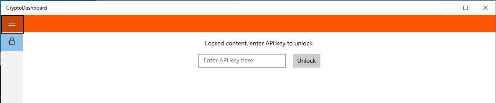
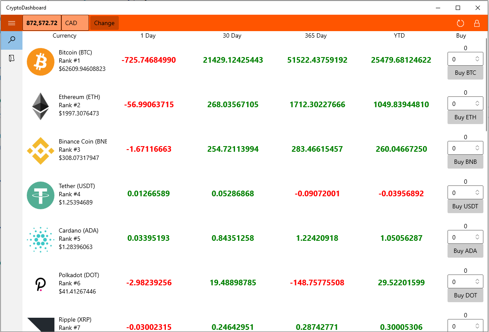
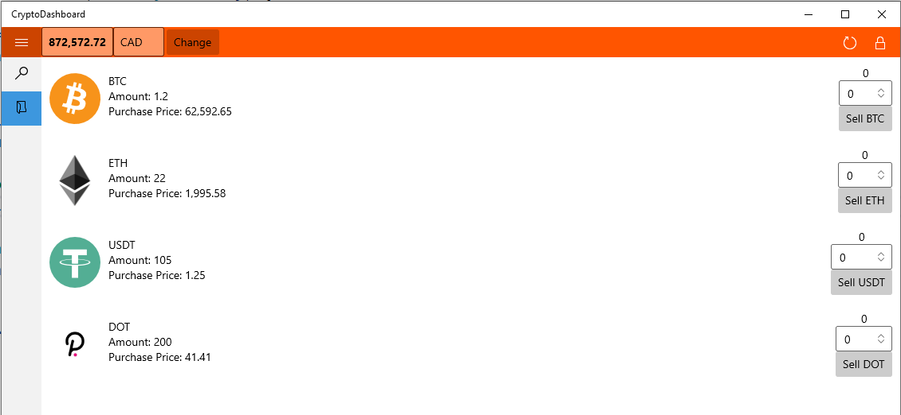

# Crypto Dashboard

Crypto-currency dashboard for Windows using the universal windows platform and [nomic](https://nomics.com/) api

## Dependency / Packages

 - [Newtonsoft_Json](https://www.nuget.org/packages/Newtonsoft.Json/13.0.1-beta1)
 - [Microsoft.UI.Xaml](https://www.nuget.org/packages/Microsoft.UI.Xaml/2.6.0-prerelease.210217002)

## TODO

 - Selling currency implementation

### Lockscreen

User must have an API key to unlock the dashboard:

### Dashboard

Dashboard, where the user can browse and purchase different currencies

### MyCurrencies

MyCurrencies tab where the user can see all purchased currencies

